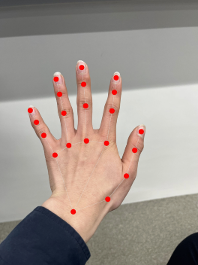

# VirtualMouse-Aerial

<p align="center">
  
</p>

## 📖 概要

VirtualMouse-Aerial は、Web カメラで手の動きを認識し、空中で手を動かすだけでマウスを操作できるハンズフリーマウスコントローラーです。

### 主な機能

- ✋ **ハンドトラッキング**: MediaPipe を使用した高精度な手の検出
- 🖱️ **マウス操作**: 人差し指の動きに連動したカーソル移動
- 👆 **ジェスチャークリック**: 中指と親指を近づけることでクリック操作
- ⚡ **高速処理**: Rust で実装されたマウス制御モジュールによる低遅延動作

## 🎮 使い方

### 基本操作

- **カーソル移動**: 人差し指を動かす
- **左クリック**: 中指と親指を近づける
- **終了**: `q`キーを押す

## 🛠️ 必要な環境

- **Python**: 3.11.13
- **Rust**: 1.85.0
- **Web カメラ**: PC に接続された Web カメラ

## 📦 インストール

### 1. 開発環境のセットアップ

#### Windows (PowerShell)

```powershell
# Rust と Python をインストール
winget install --id Rustlang.Rustup -e
winget install --id Python.Python.3.11 -e

# 新しいターミナルを開いて、Rustのバージョンを設定
rustup toolchain install 1.85.0
rustup default 1.85.0
```

#### macOS (Terminal)

```bash
# Homebrew を使用して Rust と Python をインストール
# Homebrew がない場合: https://brew.sh/index_ja
brew install rust python@3.11

# Rustのバージョンを設定
rustup toolchain install 1.85.0
rustup default 1.85.0
```

### 2. プロジェクトのセットアップと実行

#### Windows (PowerShell)

```powershell
# 仮想環境の作成と有効化
python -m venv venv
.\venv\Scripts\activate

# Rustモジュールのビルド
maturin develop --release

# 依存パッケージのインストール
pip install -r requirements.txt

# アプリケーションの起動
python main.py
```

#### macOS (Terminal)

```bash
# 仮想環境の作成と有効化
python3 -m venv venv
source venv/bin/activate

# Rustモジュールのビルド
maturin develop --release

# 依存パッケージのインストール
pip install -r requirements.txt

# アプリケーションの起動
python main.py
```

## 🏗️ プロジェクト構造

```
VirtualMouse_Aerial/
├── main.py              # メインアプリケーション (Python)
├── src/
│   └── lib.rs          # Rustマウス制御モジュール
├── Cargo.toml          # Rust依存関係設定
├── requirements.txt    # Python依存関係設定
└── README.md           # このファイル
```

## ⚙️ 設定パラメータ

`main.py`内で以下のパラメータを調整できます:

- `kando`: クリック判定の感度 (デフォルト: 10)
- `bai_a`: カーソル移動の倍率 (デフォルト: 10)

## 🔧 技術スタック

- **Python 3.11**
  - OpenCV: カメラ映像の取得と表示
  - MediaPipe: 手の検出とランドマーク抽出
- **Rust 1.85**
  - PyO3: Python-Rust バインディング
  - Enigo: クロスプラットフォームマウス制御

## 📝 ライセンス

このプロジェクトはオープンソースです。

## 🤝 コントリビューション

プルリクエストや改善提案を歓迎します！

## ⚠️ トラブルシューティング

### Web カメラが起動しない

- カメラのアクセス許可を確認してください
- 他のアプリケーションでカメラが使用されていないか確認してください

### マウスが動かない

- `maturin develop --release`で Rust モジュールが正しくビルドされているか確認してください
- macOS の場合、システム環境設定でアクセシビリティ権限を付与してください

### 依存パッケージのエラー

- Python 仮想環境が有効化されているか確認してください
- `pip install --upgrade pip`で最新の pip にアップグレードしてください
